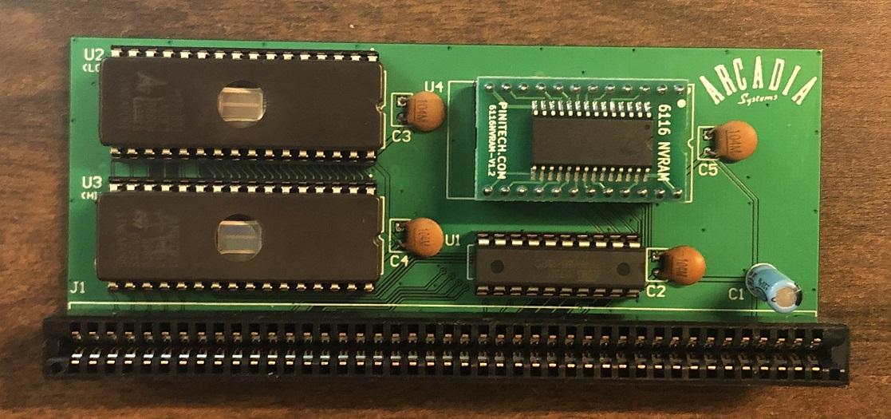

# Arcadia 2MB Cartridge

Functionality based on Arcadia "Piggyback" ROM board  
Attaches to 86-pin card edge on Amiga 500 motherboard  
ROM in the 0x800000-0x9DFFFF range with 2x 27C080 EPROMs  
NVRAM in the 0x9E0000-0x9FFFFF range with DS1220  
0xF00000-0xF1FFFF (address Amiga Kickstart attempts to execute) mapped to ROM (ROM offset 0x180000 to 0x19FFFF, i.e. same as addresses 0x980000-0x99FFFF)  
Uses GAL16V8 to decode addresses

Notes:  
NVRAM seems to need 150ns or faster  
-original cartridge used DS1220Y-150  
-DS1220Y-200 causes glitches on both new cartridge and original "Piggyback"  
-FRAM based 6116 NVRAM seems to work fine  
See ROM directory for notes on building EPROM images

Tested with female card edge connector: TE P/N 1-5530843-0, though I expect it would work with EDAC P/N 345-086-540-201 or 345-086-520-202, or other 86-pin 0.1" female card edge connectors compatible with 0.062" thick PCBs.
