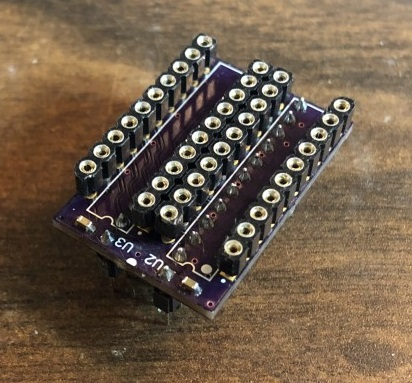

# GAL8L14

PCB replaces PAL8L14 with 2x GAL16V8

PAL8L14 (used on Arcadia "Piggyback" ROM board) has 8 inputs and 14 outputs, not commonly supported, and has no standard pin compatible GAL

Assembly notes:  
Install 2x 0603 capacitors at C1 and C2 if desired (decoupling caps, optional)  
Install header(s) at U1  
Install sockets at U2 and U3  

Depending on headers and sockets used, this can be done in a different order, though ensure sockets/headers won't block soldering iron access